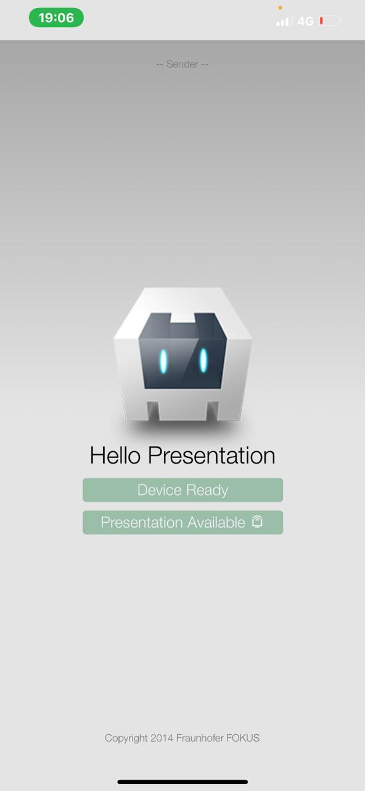

```bash
sudo npm install -g cordova
git clone https://github.com/fraunhoferfokus/cordova-plugin-presentation-helloapp
cd cordova-plugin-presentation-helloapp
cordova platform add ios
cordova plugin add cordova-plugin-presentation
cordova build ios
cordova run ios
```


Steps to reproduce the problem:
Run the app in a physical device and connect the device to a physical external display. You should see black borders around the output display image

The problem is not possible to reproduce using a virtual external display on xcode

entry code for the ios plugin is:
./plugins/de.fhg.fokus.famium.presentation/src/ios/CDVPresentationPlugin.m

 [](Screenshots/e1918b6a-65e0-4939-9f72-9b525eb8dcce.jpeg)
 (main screen)
 [](Screenshots/5b177c1a-dee5-4cc1-a49a-f5368e6bbf43.jpeg)
 (second screen)
